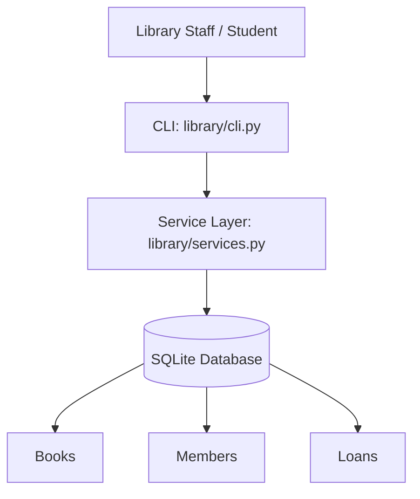
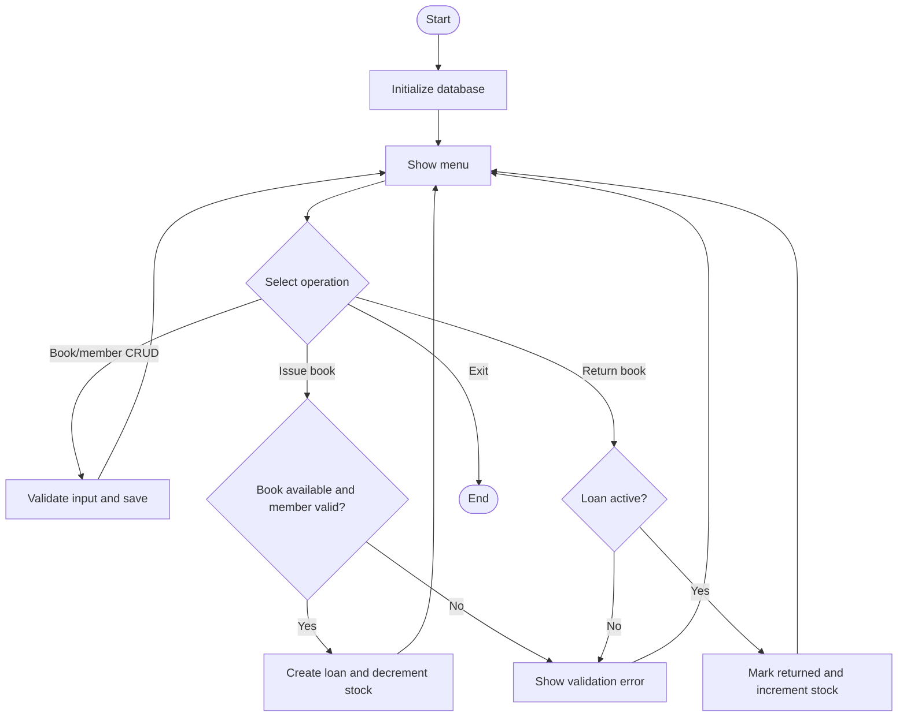
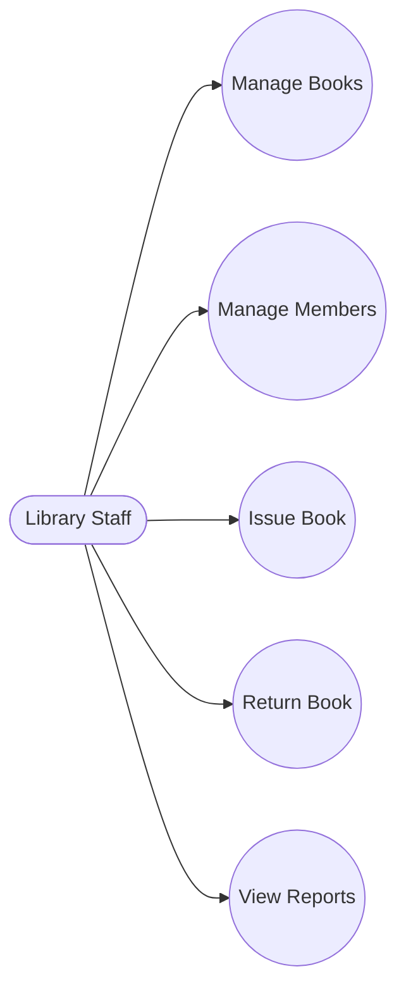
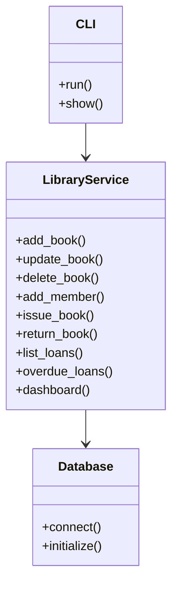
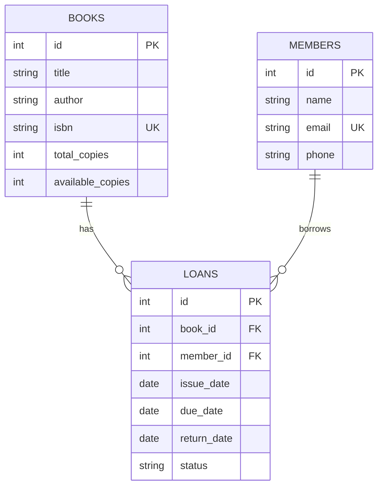

# Design and Technical Documentation

## Functional requirements
- FR1: Create, search, update, and delete book records.
- FR2: Register, search, update, and delete library members.
- FR3: Issue an available book to a registered member.
- FR4: Record returns and restore available inventory.
- FR5: List active loans and overdue loans.
- FR6: Display catalogue, inventory, member, active-loan, and overdue counts.

## Non-functional requirements
- **Usability:** menu-driven CLI with clear prompts and errors.
- **Reliability:** SQLite transactions and foreign-key constraints.
- **Data integrity:** checks prevent negative stock; unique ISBN/email values are enforced.
- **Maintainability:** database, business logic, and interface are separated into modules.
- **Performance:** indexed loan status; suitable for a small local dataset.
- **Portability:** uses Python standard library; no third-party runtime dependencies.

## Architecture


## Workflow


## Use-case diagram


## Sequence diagram: issue a book
```mermaid
sequenceDiagram
    actor Staff
    participant CLI
    participant Service
    participant DB as SQLite
    Staff->>CLI: Enter book ID and member ID
    CLI->>Service: issue_book(book_id, member_id)
    Service->>DB: Validate book/member/stock
    DB-->>Service: Records
    Service->>DB: Insert loan; decrement available copies
    DB-->>Service: Commit
    Service-->>CLI: Loan ID and due date
    CLI-->>Staff: Display confirmation
```

## Class/component overview


## ER diagram and schema


## Design decisions and rationale
- **SQLite:** lightweight, serverless, and available in Python's standard library.
- **Layered modules:** keeps persistence, business rules, and interaction separate.
- **Loan history:** returned loans remain stored for traceability.
- **Inventory invariant:** available copies are adjusted only when a loan is created or returned.
- **CLI:** keeps the mini-project small and easy to run without external packages.

## Testing approach
Run `python -m unittest discover -s tests -v`. Tests cover inventory changes during issue/return, rejection of an issue when no copy is available, and required-field validation.

## Future enhancements
Role-based login, fine calculation, CSV export, barcode support, GUI/web interface, email reminders, and multi-branch support.
